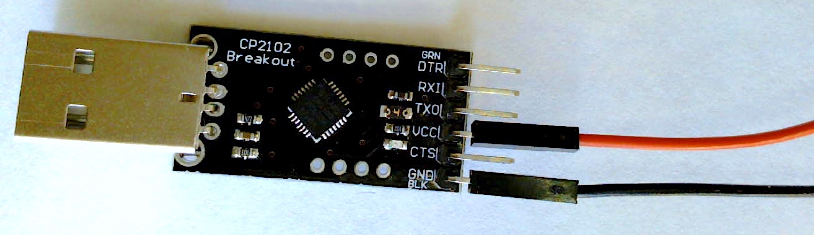
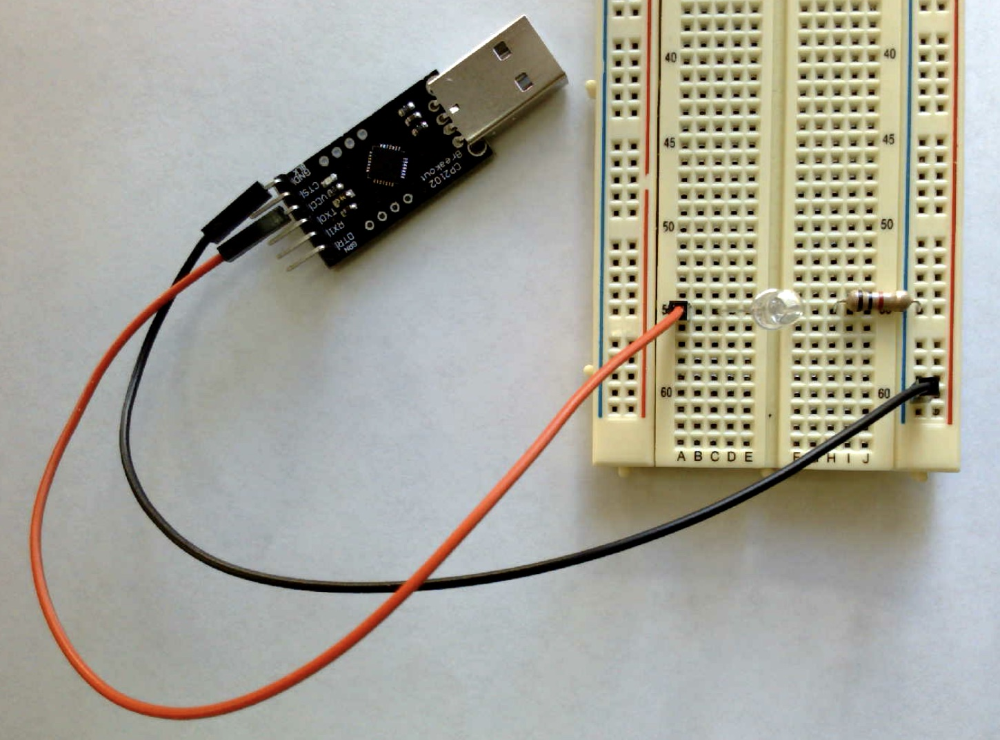
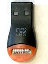
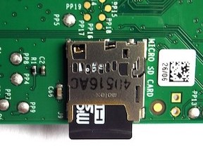


Task list to copy/paste when creating PR for this lab:

__Before releasing lab1:__
- [ ] Update firmware to latest from Broadcam
- [ ] Review writeup/code/checkin questions (instructor)
- [ ] Walk through (SL)
- [ ] Followup on issues from previous quarter postmortem (issue #224)

__To prep for lab1:__
- [ ] Review tips recorded in private/staff_notes.md and private/answers.md
- [ ] Confirm installation instructions are up-to-date
- [ ] Forum announcement for students to bring adapter if their laptop doesn't have USB-A port A (e.g. recent Macs)
- [ ] Confirm lab cabinet has SD card readers for various computers
- [ ] Prepare some SD cards with bootloader in case students can't prep their own
- [ ] Bring blank labels and pens -- students make name tag and decorate kit box
- [ ] Create Google sheet with class roster to record lab attendance



*Lab written by Pat Hanrahan, updated by Julie Zelenski*

## Goals

During this lab you will:

- Learn how to cross-develop on your computer for the Raspberry Pi's ARM processor.
- Learn how to use a breadboard with LEDs and buttons.
- Learn how to download and run bare metal programs on the Raspberry Pi.
- Revisit the assembly code for the blink program and play with it a little.

## Prelab preparation

To prepare, please do the following before coming to lab:

1. Read this SparkFun tutorial on [using a breadboard](https://learn.sparkfun.com/tutorials/how-to-use-a-breadboard#history). Pay special attention to the section labeled "Anatomy of a Breadboard" to learn about the internal connections. 
1. Organize your supplies to bring with you to lab. This week you will need:
    -  Raspberry Pi __parts kit__ (plastic box with Pi and all components) 
    - __hand tools__ (wire stripper, cutter, pliers)
    - If you own a __multimeter__, bring it also
1. You will need an open USB-A port on your laptop to connect to the Pi. If your laptop requires a USB hub or adapter, pack one into your parts kit so that you'll always have it with you.
1. Read below about how table groups work. Headphones are a nice-to-have in OhYay. Have some tasty snacks on hand to keep yourself fueled.


## OhYay, lab tables
- **Lab tables:** Our OhYay space has ten Lab Table rooms, and each table has space for four students. When you arrive at lab, please join the first table with empty seats (consider a room full if it is at 4/5 occupancy — the fifth slot is for visiting staff members). Take the first few minutes to introduce yourselves to one another and share about how your week has been going.
- **Working with friends:** If you have friends you'd like to work with, plan to arrive at lab around the same time so you end up at the same table. Feel free to use Ed to coordinate your arrival times.
- **Multimeters:** If your table has more than one person with a multimeter, consider swapping an extra multimeter-owner into a different group, so that each table has at least one multimeter.
- **Table collaboration:**  The goal is for your table group to work as a team, going through the exercises together and discussing as you go. Stay unmuted so you can easily jump in with questions and answers. (Our physical lab is a din, we hope our OhYay space can be just as lively!) One person per table shares their screen and acts as a "driver". The driver's role is to help herd the cats and set the pace, but everyone is doing the same steps on their own computer. The job of driver rotates. We will have a poll question to help decide whose turn it is to start as driver.
- **Asking for help:** If your table has a question or runs into an issue that can't be resolved within the group, grab a staff member to bring to your table to help. When not already with a table, the staff plans to hang out in Bytes Cafe so look for us there.
- **Check-in questions:** As you hit each check-in point, confer with your table to ensure there is agreement and understanding for everyone before moving on. Ask a staff member to come review your answers. We recommend that you check-in as you go rather than waiting to do all questions at the end.

## Lab exercises

> This lab has a few activities that use a multimeter. Alas, we are not in our lab room where we can supply those tools for you. If one of your table group has access to a multimeter, please use it! If not, try to work through what you expect the experimental results to be and check-in with one of the staff to confirm your understanding.
{: .callout-info}


### 0. Clone the lab repo
When starting each new lab or assignment, do a `git pull` in your copy of the `cs107e.github.io` repository to ensure your courseware files are up to date.

```console
$ cd $CS107E
$ git pull
```

The lab materials are distributed in a separate git
repository. We recommend that you store your copy of the lab under your `cs107e_home`.  Change to that directory now and clone lab1:
```console
$ cd ~/cs107e_home
$ git clone https://github.com/cs107e/lab1
```

<a name="ex1"></a>
### 1. Build blink

To confirm that your developer tools are installed correctly, build the
`blink` program from its assembly code.  Change to
the lab subdirectory that contains the `blink` example and build the
`blink` program using these commands:
```console
$ cd lab1/code/blink
$ arm-none-eabi-as blink.s -o blink.o
$ arm-none-eabi-objcopy blink.o -O binary blink.bin
```
The middle step assembles the ARM instructions in `blink.s` into an "object
file", a particular file format for binary code. An object file has a
lot of information in it that we don't need -- we just want the
program.  The last step, with `arm-none-eabi-objcopy`, turns this
object file into a raw binary that has just the program named
`blink.bin`.  If above commands execute without error, you are good to
go!

### 2. Breadboard LED circuit

Next you will wire up a simple circuit on your breadboard to light an
LED. Recall from the [tutorial from prelab](#prelab-preparation) how the breadboard is internally constructed.  Which
holes are connected to which other holes?  How are the power and
ground rails connected? Try using a multimeter to verify the internal connections. Grab two male-male jumpers from your kit and plug one end of each into two holes on the breadboard. Confirm that that those two holes are connected (or not) by applying the multimeter leads to the free ends of the two jumpers and testing for continuity.

Pick out a LED and a 1K resistor from your kit. A resistor's value is [marked by its colored bands](https://learn.sparkfun.com/tutorials/resistors#decoding-resistor-markings). What are the band colors for 1K? Measure the resistance using a multimeter to confirm the value.

Make a circuit on your breadboard with the LED and resistor. 
Note that an LED is directional.  The longer lead is the anode and the
shorter lead is the cathode.  The voltage from anode to the cathode
should be positive.  If the polarity of voltages are switched, the LED
will not light up.  The LED also needs a current limiting resistor
otherwise it can literally [blow up in a fiery, smoky
extravaganza](https://www.youtube.com/watch?v=WLctUO1DGtw)!

In the photo below, the cathode of the LED connects to one end of the
to resistor and the other end of the resistor connects to the
the blue ground rail.  The LED crosses over the middle of the
breadboard.  

{: .zoom}

We are just playing with this circuit in lab, so we won't worry about making things tidy and secure. When installing a more permanent circuit for assignment 1, you can use your pliers to make a clean bend in the legs and snip the ends with a cutter so that each component sits neatly on the breadboard. 

To light up the LED, you need to apply power to the anode
and complete the circuit by connecting the cathode to GND.   The power will 
come from your laptop using a *CS2102 USB to Serial Adapter*
(hereafter referred to as just "USB-serial").  This is the small black
breakout board with a USB-A connector on one side and a 6-pin header
on the other side.  

Find the USB-serial in your parts kit. Plug it into a USB-A port on
your laptop. Depending on your laptop, you may need a hub or adapter. Once plugged in, a small LED on the the USB-serial turns on to show power is flowing. After confirming it powers up, unplug it from your laptop.

You can use the USB-serial to power the circuit on your breadboard. Follow these steps __in order__:

1. Pick out two female-male jumpers, one red and one black. When wiring, people experienced in electronics choose the color of the wire used to indicate what type of signal is being carried.  This makes debugging wires and visualizing what's going on much easier. Here are conventions we adopt:

    -   Black (GND)
    -   Red (5V)
    -   Orange (3.3V)
    -   Blue (host output)
    -   Green (host input)

    You are running power and ground so red and black are the right choices.

1. Connect the female jumper ends to the header pins on the USB-serial: the black jumper connects to the header labeled GND and the red to the one labeled VCC or +5V. The pin layout on your USB-serial may
be different than the one in the photo: pay attention to what the pins
are labeled, not their physical location.

    {: .zoom}

1. Plug the male ends of the jumpers into the breadboard: the black jumper connects to the blue ground rail and the red jumper to the LED anode (longer leg).  The 1k resistor should be in the circuit between the LED cathode
(shorter leg) and GND.

    {: .zoom}

1. After double-checking that your circuit wiring is correct, you're
ready to apply power. Plug the USB-serial into
your laptop and the LED on your breadboard should turn on.

While the LED is lit, make the following measurements with the multimeter.

-   Measure and record the voltage across the resistor
-   Measure and record the voltage across the LED

Given these values, you can calculate the current flowing through the LED. If your table group doesn't have a multimeter, ask a staff member
what these values would be if you were to measure them, and use those values to do the calculation.

If using a 10K resistor in place of the 1K, how would that change the amount of current flowing?  What effect would it have on the brightness of the LED? Find a 10K resistor in your kit and swap it in (be sure to disconnect power before fiddling with the wiring!) and see the effect with your own eyes.

You are ready to answer the first check-in question[^1]

### 3. Power via the Pi
Get your Raspberry Pi from your kit. Identify the 40-pin GPIO header along the long edge. Orient the header to match the [pinout diagram](/guides/images/pinout.pdf). The pinout is also available as a postcard in your kit and a poster on lab wall. We even have a command-line version that display in retro ascii art.
```console
$ pinout
```
Use the pinout to identify two 5V power pins and two GND pins on your Pi; you'll use these pins in this exercise.

You are going to re-wire your circuit to run power/ground from the USB-serial first to the Raspberry Pi and from there to the breadboard.  Follow these steps __in order__:

1. First, unplug the USB-serial from your laptop so that no power is flowing. 
    >**Danger** Always have the USB-serial unplugged from your laptop
    whenever you are fiddling with the wiring.
    If you leave it plugged in, power is flowing and all wires are live, which makes for a dicey situation. An accidental crossed wire can a short circuit, which could fry your Pi or make your
    laptop disable the USB port.
    {: .callout-danger-invert}

2. Disconnect the USB-serial from the breadboard and connect instead to the Raspberry Pi. Pick out two female-female jumpers, one black and one red. Black black connects the GND on the USB-serial to a GND GPIO on the Raspberry Pi and red to connect VCC/5V to 5V GPIO.

3. Connect power and ground from the Raspberry Pi to the breadboard using the two female-male jumpers.  The black jumper connects a GND GPIO on the Raspberry Pi to the blue ground rail on the breadboard. The red jumper connects a 5V GPIO to the LED anode.

4. After double-checking your wiring, apply power by plugging the USB-serial in your laptop. All three LEDs should light: the one on the USB-serial, the red PWR LED on the Raspberry Pi, and the LED on the breadboard. Power flows from the USB-serial to the Raspberry Pi and through to the breadboard. 
 Your circuit is complete!

    {: .zoom}

### 4. Prepare SD card
Get the microSDHC card {: .d-inline } and USB card reader {: .d-inline } from your parts kit.  You will use these to prepare a SD card with the firmware files needed for the Raspberry Pi. The USB card reader in your kit is inexpensive and its construction is a bit flimsy. If your laptop has a built-in SD card reader or you have a more robust external SD card reader of your own, feel free to use it in place of this one. 

The firmware files you need are published in our courseware repo. You will copy these files onto the SD card using a card reader on your laptop.


>If your laptop doesn't have an SD card slot or the card slot isn't cooperating, ask your partner to use their computer or borrow a USB card reader from us. Configuring your SD card is a one-time task. You will not need to modify it again and in future will use the bootloader, so do whatever is most expedient to prep your SD card and move on.
{: .callout-info}


Follow these steps:

1. Plug the USB card reader into your laptop (it may require an adapter) and insert the SD card into the card reader.  The SD card should mount automatically and the volume shows up in the macOS Finder or Windows File Explorer.  By default, the volume is named `NO NAME`. You can change the name if you wish.

2. Confirm the firmware folder contains these four files:

    ```console
    $ ls $CS107E/firmware
    blink-actled.bin   bootloader.bin  bootcode.bin       start.elf
    ```

    The `bootcode.bin` and `start.elf` files are needed for the Raspberry Pi reset sequence. The two additional files
    `blink-actled.bin` and `bootloader.bin` are programs.

3. Copy the four files from the firmware folder onto the mounted SD card volume.
    - On macOS, the SD card volume is mounted under the parent directory `/Volumes`. Change to the card volume and copy the firmware files here:

        ```console
        $ cd /Volumes
        $ ls
        Macintosh HD    NO NAME
        $ cd NO\ NAME
        $ cp $CS107E/firmware/* .
        ```
        {: .console-mac}

    - WSL does not have access to the mounted volume so you must use the Windows File Explorer.  Use the commands below to open the firmware directory in File Explorer. The copy the four files from the folder onto the mounted SD card.
        ```console
        $ cd $CS107E/firmware
        $ explorer.exe .
        ```
        {: .console-ubuntu}

4. The SD card needs an additional file named `kernel.img`. 
    Normally, `kernel.img` is the operating system kernel you want to run, like Linux or Windows. In this course, we will write our own program to take the place of the kernel, and put our program under the name `kernel.img`. One of the firmware files is a program called `blink-actled.bin` that blinks the green activity (ACT) LED on the Raspberry Pi board. We are going to use this blink program as the kernel for a test.

    On the SD card, make a copy of the `blink-actled.bin` file and name it  `kernel.img`. 

3. Confirm that the SD card contains the essential files for the reset sequence: `bootcode.bin` `start.elf` and `kernel.img`. The card can also contain additional files; any other files are ignored.

4. Eject the SD card in the Finder/File Explorer.  If Terminal prevents you from ejecting, type in `cd ..` to move to the parent folder and try ejecting again.

5. Insert the SD card into the slot on the bottom side of the Raspberry Pi board. The slot has a small spring that holds the card in place. As you push the card in, you will feel the mechanism grab onto the card and secure it.

    {: .zoom .w-25}

6. Power the Pi.  The green ACT LED on the Pi's board
should slowly blink.

Keep this procedure for preparing a fresh SD card in the back of your mind.
If you ever think your Pi is not working because of a hardware problem,
repeat these steps, using the blink program to confirm the basic operation.

You can read additional advice on troubleshooting SD cards and the Pi reset sequence in our [guide to SD cards](/guides/sd#troubleshooting).

### 5. Blink breadboard LED
The `kernel.img` file currently on the SD card is a copy of the `blink-actled` program which pulses the on-board ACT LED.  Each time we reset the Pi, it runs this same program. To change the program, we must mount the SD card back on our laptop and prepare the card with a different program.

Let's try that now. We want to test the `blink` program that you built in exercise 1. This program pulses GPIO 20. Re-configure your breadboard circuit to connect GPIO 20 to the anode of the LED.  Be sure that the USB-serial is unplugged before rewiring!  Use the [pinout](/guides/images/pinout.pdf) to identify which header pin is GPIO 20.

{: .zoom}

Now, we need to update the files on the SD card to use the `blink` program in place of `blink-actled`.  To modify the files on the SD card, you have to remove it from the Pi and mount it back on your laptop.

>**Do not force the mechanism!** When removing the micro-SD from the Pi's card slot, gently push the card in and allow it to spring back out. If you try to pull out the card by force, you can break the mechanism and potentially destroy your Pi.
{: .callout-danger-invert}

Once you have the SD card mounted on your laptop, copy the `blink.bin` file (the one you built in [exercise 1](#ex1)) to the card and name it `kernel.img`, replacing the file that was previously there.

Eject the SD card from your laptop and insert the card into the Raspberry Pi.

Power your Pi and it now runs the `blink` program, which blinks the LED on your breadboard.

You have just run your own bare metal program on the Raspberry Pi -- hooray!

### 6. A better way: bootloader

Each time you change your code, you could repeat this process.
You would
power down your Pi, eject the SD card, 
mount the SD card on your laptop,
copy the new version of your code to `kernel.img`, eject the SD card from your laptop,
insert it into the Pi,
and then power it up.
This quickly becomes tedious.
Even worse, the SD connectors are only designed to withstand
around 1000 insertions and deletions, after which they start to fail.

Instead, you can set up a serial connection between your laptop and the Pi and use a __bootloader__ to transfer the program. The bootloader is a program that runs on the Pi
and listens on the serial connection. On your laptop, you run a script to send the program to the waiting 
bootloader. The bootloader receives the program and writes it to the
memory of the Pi, a process called "loading" the program. After the
program is loaded, the bootloader jumps to the start address of the program,
and the program begins to run.

To stop that program and start another, reset the Pi and use the bootloader again.  This is much more convenient way to run your newly compiled program than all that shuffling of SD cards. You will learn to love the bootloader!

First, you must use the bootloader program as the kernel on your SD card:

1. Mount the SD card on your laptop. The SD card should already contain a file called `bootloader.bin` (it was one of the firmware files copied in exercise 4). Make a copy of
   `bootloader.bin` and name it `kernel.img`, replacing the program
   that was previously there.

2. Eject the SD card and insert it into the Raspberry Pi. Now whenever you reset the
Pi with that SD card installed, the bootloader will run.

To use the bootloader, you must set up the communication channel between your computer and the Pi.  The USB-serial contains pins that can be used as a serial communication line.

The 6-pin header at the end of the USB-serial breakout board has two pins labeled for transmitting (TX) and receiving (RX).
The Pi also has a TX and RX pin (GPIO pins 14 and 15, respectively). Use the [pinout](/guides/images/pinout.pdf) to find the TX and RX pins on the GPIO header.

Pick out two female-female jumpers, one blue and one green. Use the blue jumper to connect the TX on the USB-serial to the RX on the Pi, and the green jumper to connect RX on the USB-serial to the TX on the Pi. As always, first unplug the USB-serial from your laptop before re-wiring.

>__Careful with the connections__ The connections run from one device's TX to the other's RX, and vice versa. Do **not** connect TX to TX and RX to RX! Also note that the pins on your USB-serial
may be in different positions or have different label names. Don't just follow the picture blindly!
{: .callout-warning}

{: .zoom}

In the above photo, the green wire connects
the RX header pin on the USB-serial
to the Pi's TX pin (GPIO 14).
The blue wire connects the TX header pin on the USB-serial
to the Pi's RX pin (GPIO 15).

Plug in your USB-serial to power your Pi. The bootloader should run on reset. When the bootloader is running, it signals that it is waiting to receive a program by repeatedly giving two short flashes of the green ACT LED on the Pi board. This "da-dum" is the heartbeat that tells you the bootloader is ready and listening. Look at your Pi now and observe this rhythm. Breathe in sequence with it for a moment to celebrate having achieved bootloader readiness.

Our Python script `rpi-run.py` runs on your laptop to send a program to the bootloader. Verify you have Version 2.0 from the following command:

```console
$ rpi-run.py -h
usage: rpi-run.py [-h] [-v] [-q] [-t T] [-p | -s] [port] file
    
This script sends a binary file to the Raspberry Pi bootloader. Version 2.0
...
```

Let's try bootloading a program. On your laptop, change to the `lab1/code/blink/`
directory where you built `blink.bin` in exercise 1.

Use this command to send `blink.bin` to the bootloader:

```console
$ rpi-run.py blink.bin
Found serial device: /dev/cu.SLAB_USBtoUART
Sending `blink.bin` (72 bytes): .
Successfully sent!
```

While receiving a program, the bootloader turns on the ACT LED and holds it steady until transmission is complete. The bootloader then turns off the ACT LED and transfers execution to the received program. The `blink.bin` program will pulse GPIO 20 which is connected to the LED on your breadboard.

If you change your program and want to run it again, you must first 
reset the Pi. What happens if you try to `rpi-run.py` a second time
after the bootloader has already loaded a program? Why does that happen?

One way to reset the Pi is to briefly cut power by unplugging the USB-serial
from your laptop,
and then plug it in again.
The Pi will restart into bootloader, ready to receive a new program. 

Reset your Pi now and re-run the blink program. Hoorah, hoorah, hoorah!! 👏 Show off your working edit-build-run cycle when you check-in with us [^2]

### 7. Study the blink program

Below is the blink program that Pat wrote in Monday's lecture. This code is available in the file `lab1/code/blink/blink.s` and also reproduced below.

    .equ DELAY, 0x3F0000

    // configure GPIO 20 for output
    ldr r0, FSEL2
    mov r1, #1
    str r1, [r0]

    mov r1, #(1<<20)

    loop: 

    // set GPIO 20 high
    ldr r0, SET0
    str r1, [r0] 

    // delay
    mov r2, #DELAY
    wait1:
        subs r2, #1
        bne wait1

    // set GPIO 20 low
    ldr r0, CLR0
    str r1, [r0] 

    // delay
    mov r2, #DELAY
    wait2:
        subs r2, #1
        bne wait2

    b loop

    FSEL0: .word 0x20200000
    FSEL1: .word 0x20200004
    FSEL2: .word 0x20200008
    SET0:  .word 0x2020001C
    SET1:  .word 0x20200020
    CLR0:  .word 0x20200028
    CLR1:  .word 0x2020002C

If there is anything you don't understand about this program,
ask questions of your partner and others.

Do the following exercises:

-   Look at the bytes in the `blink.bin` you built earlier by
    running `hexdump blink.bin` at a shell in the `blink` folder.

    (`hexdump` is a command that prints the bytes in a file in a
    human-readable form. You can run `man hexdump` to learn more. What are
    the numbers at the beginning of each line `hexdump` outputs?)

    Find the first occurrence of `e3` and count the offset in bytes from the start of the file to answer this check-in question.[^3]

-   Change the program such that the blink rate slows down by a factor
of 2.

    Modifying the program is a multi-step process. First
    you edit `blink.s` in a text editor, then use the
    commands in [exercise 1](#ex1) again to rebuild `blink.bin` . To run the new program, first reset your Pi by unplugging and replugging, then use `rpi-run.py` to send your new `blink.bin` to run on the Pi. Make sure you understand why
    these steps are all necessary.
    
    Experiment with changing the value of delay to achieve a blink rate of roughly 1 second on and 1 second off. Using that value you can calculate an estimate how many instructions per second the
    Raspberry Pi is executing. You can now answer this check-in question[^4].

<A name="button"></A>
### 8.  Adding a button
The final lab exercise is to study the `button` program and build a breadboard circuit to test the program. This button program is in the file `lab1/code/button/button.s`.

The button program reads the state of a button connected to GPIO 10 and turns on the LED on GPIO 20 when the button is pressed.

    // configure GPIO 10 for input
    ldr r0, FSEL1
    mov r1, #0
    str r1, [r0]

    // configure GPIO 20 for output
    ldr r0, FSEL2
    mov r1, #1
    str r1, [r0]

    // bit 10
    mov r2, #(1<<10)

    // bit 20
    mov r3, #(1<<20)

    loop: 
        // read GPIO 10 
        ldr r0, LEV0
        ldr r1, [r0] 
        tst r1, r2
        beq on // when the button is pressed (goes LOW), turn on LED
        
        // set GPIO 20 low
        off:
            ldr r0, CLR0
            str r3, [r0]
            b loop

        // set GPIO 20 high
        on:
            ldr r0, SET0
            str r3, [r0]
            b loop

    FSEL0: .word 0x20200000
    FSEL1: .word 0x20200004
    FSEL2: .word 0x20200008
    SET0:  .word 0x2020001C
    SET1:  .word 0x20200020
    CLR0:  .word 0x20200028
    CLR1:  .word 0x2020002C
    LEV0:  .word 0x20200034
    LEV1:  .word 0x20200038


Challenge yourself to understand
what each line of code accomplishes and why it works as expected.
You may want to add your own code annotations as you figure out each line. Have the [Broadcom peripheral manual](/readings/BCM2835-ARM-Peripherals.pdf) handy for looking up information about the peripherals. And here is the documentation for the [ARM instruction set](/readings/armisa.pdf).

Here are a few questions to test your understanding.

-  What information is stored in peripheral register at address 0x20200034?
-  What is the relationship between the `SET0`, `CLR0`, and `LEV0` registers?
-  What value is being tested by the `beq` instruction?

With this knowledge, you're ready to answer the check-in question[^5].

Now that you understand how the program operates, you can reconfigure your breadboard circuit to test the program. 

Grab a button mechanism and button cap from your parts kit.  Measure the resistance across the pushbutton legs using a multimeter and figure out which pins are always connected and which become connected when the button is pushed.  Use these observations to determine how to position the button on the breadboard to act as a switch.

The last detail to work out is the default state of the input pin used to read the button state. Before we connect the pin to something, its voltage is in a "floating" state. It's up to us to intentionally pull the pin to a known initial state so we get a reliable reading. The button program above is written to expect an initial state of high. We will connect the pin to the power rail via a 10K resistor and "pull up" the line to set its initial state as high. GPIO 10 will initially read as high. When the button is pressed, it grounds the circuit and GPIO 10 will read low.  Sparkfun has a nice tutorial on the [use of pull-up resistors](https://learn.sparkfun.com/tutorials/pull-up-resistors/all) for more information.

Here is the schematic. VCC is 3.3V and R1 is 10K.


{: .w-50 .mx-auto}

Add the above circuit on your breadboard and use GPIO 10 as your input pin. Use your pinout to find GPIO 10 on the Raspberry Pi header. Be sure to include the 10K resistor! (without, it pressing the button would create a short between power and ground) 

After confirming your circuit is correctly constructed, power it up and run the button program. In the initial state, the LED is off. When you press and hold the button the LED turns on.  Let there be 💡!

## Check in with TA

Each table group should periodically touch base with the TA as you answer the check-in questions below. The check-in allows us to
verify your understanding and help with any unresolved issues.

Remember that the goal of the lab is not to answer exactly and only these questions -- it's to work through the material. The questions are an opportunity to self-test your understanding and confirm with us.

[^1]: How much current flows through the LED with a 1K resistor? With a 10K?
[^2]: Show us that you have a working cycle for edit/compile/execute program on your laptop and Pi. We want to be sure everyone leaves lab with this success under their belt!
[^3]: What is the offset in bytes where `e3` first occurs in `blink.bin`?
[^4]: What is your experimental estimate of the number of instructions per second executed by the Raspberry Pi?
[^5]: Explain the relationship between the `SET0`, `CLR0`, and `LEV0` registers.


It's okay if you don't completely finish all of the exercises during
lab; your sincere participation for the full lab period is sufficient
for credit.  However, if you don't finish, we highly encourage you to
work those parts to solidify your knowledge of this material before
moving on. In particular, having successfully completed this lab is a necessary step before tackling this week's assignment.

<style>
    .footnote:before {
        content: ' Q-';
    }
    .footnotes:before {
        content: "Check-in questions";
        font-size: 125%;
    }
</style>

